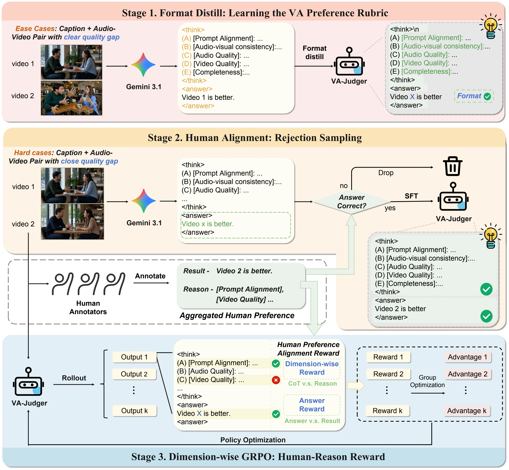

# VA-Judger: Reward Modeling from Human Preference Feedback for Joint Video-Audio Generation

<a href="https://sharelab-sii.github.io/VA-Judger/"></a>
<a href="https://arxiv.org/abs/2608.18607"></a>
<a href="https://huggingface.co/YinmingHuang/VA-Judger"></a>
<a href="https://huggingface.co/datasets/YinmingHuang/VA-Judger-Bench"></a>

[Yinming Huang](https://yinminghuang.github.io/)<sup>1,2,\*</sup>, [Shuyuan Tu](https://github.com/Francis-Rings)<sup>2,\*</sup>, Xi Yan<sup>2</sup>, [Zihan Yang](https://github.com/pnotp)<sup>2</sup>, [Jianhua Han](https://scholar.google.com/citations?user=OEPMQEMAAAAJ&hl=en)<sup>3</sup>, [Xu Hang](https://scholar.google.com/citations?user=J_8TX6sAAAAJ&hl=en&oi=ao)<sup>3</sup>, [Yu-Gang Jiang](https://scholar.google.com/citations?user=f3_FP8AAAAAJ&hl=en)<sup>2,†</sup>, [Zuxuan Wu](https://scholar.google.com/citations?user=7t12hVkAAAAJ&hl=en)<sup>1,2,†</sup>

<sup>1</sup>Shanghai Innovation Institution
<sup>2</sup>Fudan University
<sup>3</sup>Yinwang Intelligent Technology Co., Ltd

<sup>*</sup>Equal contribution. <sup>†</sup>Corresponding authors.

### 🔥 VA-Judger is the first reward model for Joint Video-Audio Generation.

**❤️ If you find our work useful, please consider giving a star ⭐ to this GitHub repository ❤️.**

## Abstract

Using reinforcement learning to post-train joint video and audio generation models requires a reward signal. Existing methods construct this reward by combining metrics for individual quality dimensions, including audio quality, visual fidelity, and synchronization. However, these metrics evaluate perceptual dimensions separately and fail to capture the holistic coherence across text, video, audio, motion, and semantics that drives human preference. More critically, they are poorly aligned with actual human judgments. Optimizing models against these metrics encourages reward hacking, generating video-audio content that achieves high scores on these metrics yet appears incoherent or unfaithful to human viewers. To address this problem, we first construct a large-scale human-preference dataset **VAPref-10K** for joint video-audio generation, comprising 9K prompts and 10.3K fine-grained paired comparisons from open-source generation models. We also introduce the **VA-Judger-Bench** benchmark with both in-domain and out-of-domain model comparisons to evaluate whether reward models truly align with human preferences. We further propose **VA-Judger**, a chain-of-thought omni-reward model for joint video-audio generation. In particular, VA-Judger first learns from pairs with clear quality gaps to establish structured output and coarse preference discrimination, then distills reliable preference explanations for harder near-quality comparisons via rejection sampling verified against human annotations, and finally performs dimension-wise reinforcement learning that decomposes human feedback into individual quality dimensions for denser reward signals than a single binary preference label. Experiments show that VA-Judger outperforms metric baselines in predicting human preferences on both in-domain and out-of-domain evaluations. Using its human-aligned rewards for post-training audio-video generation models also yields significant improvements in generation quality.

## Generation Demos

**Please turn on your audio.** Each case compares LTX-2, OmniNFT, and LTX-2 post-trained with VA-Judger.

### Case 01

**Prompt.** A brown and white cow, with large, gentle eyes and a slightly bewildered expression, stands on a sun-drenched pasture. It is awkwardly holding an acoustic guitar, its hooves fumbling with the strings. The cow attempts to strum a chord, but instead of music, a series of loud, resonant "Moo!" sounds emanate from its throat, clearly not aligning with the intended melody. The camera employs a medium shot to capture the cow's comical struggle, with a slight zoom in to emphasize its earnest but unsuccessful efforts. The lighting is bright and natural, characteristic of a clear day, with a slightly desaturated color palette to give a touch of whimsicality. The overall style leans towards gentle, humorous illustration, with a focus on the visual absurdity of the scene. The dominant sound is the repeated, drawn-out "Moo!", punctuated by the faint, comical rustle of hay.

<table>
  <tr><th>LTX-2</th><th>OmniNFT</th><th>Ours</th></tr>
  <tr>
    <td><video src="https://github.com/user-attachments/assets/a78d34a5-fe31-4f05-a939-6913d2229d8f" width="320" controls loop></video></td>
    <td><video src="https://github.com/user-attachments/assets/8e1d52d4-cbca-4c44-b334-29fb06fb1fb9" width="320" controls loop></video></td>
    <td><video src="https://github.com/user-attachments/assets/02d08733-bc8f-4974-9734-51e32fdf3568" width="320" controls loop></video></td>
  </tr>
</table>

### Case 02

**Prompt.** A quiet garden shot shows a rabbit nibbling grass with tiny quick bites that make faint crunching sounds. A sudden distant noise makes the rabbit freeze, ears upright, then it thumps one hind foot sharply on the ground with a dull thud. After a brief still moment, it darts away through dry leaves that crackle rapidly as it disappears.

<table>
  <tr><th>LTX-2</th><th>OmniNFT</th><th>Ours</th></tr>
  <tr>
    <td><video src="https://github.com/user-attachments/assets/91cd806d-9d3a-4b85-a6c7-5d5920b66f85" width="320" controls loop></video></td>
    <td><video src="https://github.com/user-attachments/assets/04ac5379-9da5-483a-9776-acf6f6750375" width="320" controls loop></video></td>
    <td><video src="https://github.com/user-attachments/assets/34280270-8239-4324-9e56-3eea1c4f90c0" width="320" controls loop></video></td>
  </tr>
</table>

### Case 03

**Prompt.** From a slight high-angle, an extreme close-up captures a pair of steady hands guiding a large chef's knife as it slices a ripe tomato on a wooden cutting board. The scene is shot in a high-saturation photographic style, with bright, even light enhancing the dominant reds of the vegetables and the warm tones of the wood grain. Scattered across the board are diced red bell pepper pieces, and whole cherry tomatoes sit softly blurred in the background. In the top-left corner, a circular logo displays the text "Men With The Pot" with three stylized pine trees above it. The hands continue their work, gliding the knife back and forth in a steady, rhythmic motion. With each pass of the blade, small, neatly cut pieces of tomato fall away to join the other diced vegetables on the board. The shallow focus keeps the sharp edge of the knife and the central tomato in high detail, while the background tomatoes and the wider surface of the board remain out of focus, emphasizing the texture and motion of the chopping. The audio shows soft birdsong filtering through the air, creating a gentle and natural ambient rhythm for the scene.

<table>
  <tr><th>LTX-2</th><th>OmniNFT</th><th>Ours</th></tr>
  <tr>
    <td><video src="https://github.com/user-attachments/assets/bc5b9c90-7af8-4560-8e94-2d82268066c3" width="320" controls loop></video></td>
    <td><video src="https://github.com/user-attachments/assets/69584d3f-b6ea-47ba-b125-7dd1a506289a" width="320" controls loop></video></td>
    <td><video src="https://github.com/user-attachments/assets/bf70a01e-6db5-4081-86eb-a94515b7cb78" width="320" controls loop></video></td>
  </tr>
</table>

### Case 04

**Prompt.** In a formal conference setting under even, frontal lighting, a woman with short gray hair and purple-framed glasses speaks into a black gooseneck microphone. She wears a bright red blazer over a dark top with a patterned necklace and matching bracelet. To her left, a blue banner displays the partial white text "challenges and expertise". To her right, a large projection screen shows a faint world map graphic with the text "COP28 OUT", "Keynote address: former Prime Min...", "#C...", and "Kindly supp...". As she continues her address, her mouth moves in sync with her speech, and she maintains a confident posture, gesturing with her right hand to emphasize her points. The medium, eye-level shot keeps her in focus, with the banner and screen slightly blurred in the background. At one point, she says, "将会被怀念。海平面将会上升。小。" The audio shows the woman's clear voice, captured by the microphone, blended with the subtle ambient sounds of an occupied indoor space, suggesting the quiet presence of an audience.

<table>
  <tr><th>LTX-2</th><th>OmniNFT</th><th>Ours</th></tr>
  <tr>
    <td><video src="https://github.com/user-attachments/assets/94f31792-4327-4d3c-aef7-623801540678" width="320" controls loop></video></td>
    <td><video src="https://github.com/user-attachments/assets/44e0b5d2-3d69-45e3-8811-0689c27f3db7" width="320" controls loop></video></td>
    <td><video src="https://github.com/user-attachments/assets/f04d3f79-c832-4b5a-a31c-2a484eef5006" width="320" controls loop></video></td>
  </tr>
</table>

## Overview



*VA-Judger learns the comparison rubric from easy pairs, aligns with human feedback on hard pairs, and is refined with dimension-wise GRPO.*

## 🛠️ To-Do List

- [x] Reward model SFT code
- [x] LTX-2 RL code
- [x] VA-Judger-Bench
- [x] VA-Judger checkpoint
- [x] RL post-trained LTX-2 checkpoint
- [x] Reward model inference code
- [x] Video model inference code
- [ ] Reward model dimension-wise GRPO code
- [ ] VAPref-10K dataset release

VA-Judger provides an end-to-end recipe for:

1. evaluating a Qwen3-Omni audio-video preference reward model on VA-Judger-Bench;
2. generating audio-video samples with an LTX-2 model merged with the released RL LoRA;
3. supervised fine-tuning of the reward model with MS-Swift; and
4. optimizing LTX-2 with dimension-aware GRPO rewards from VA-Judger.

The reward model compares two candidate audio-video generations for the same prompt. It predicts the preferred candidate and scores prompt alignment, audio-video consistency, audio quality, video quality, and content completeness. During video-model RL, these scores are routed to the shared, audio, and video branches of LTX-2.

## Repository layout

```text
VA-Judger/
├── rewardmodel/               # Reward-model SFT and VA-Judger-Bench evaluation
│   ├── scripts/
│   ├── environment-train.yml
│   ├── environment-eval.yml
│   └── README.md
├── videorl/                   # LTX-2 GRPO and released-LoRA inference
│   ├── config/
│   ├── dataset/
│   ├── flow_grpo/
│   ├── ltx_v2/
│   ├── scripts/
│   └── README.md
└── README.md
```

Run the commands below from the `VA-Judger/` repository root unless a section explicitly changes directories. Linux, Miniconda/Conda, NVIDIA GPUs with a compatible CUDA driver, and Hugging Face access to the gated upstream models are assumed. The video pipeline also requires `ffmpeg`.

## Quickstart

The shortest runnable path is split into reward-model inference and LTX-2 video inference. Training is documented separately under [Model training](#model-training).

### 1. Reward-model inference on VA-Judger-Bench

#### Set up the vLLM environment

Reward-model inference uses a dedicated environment because its MS-Swift and vLLM versions may conflict with the LTX-2 stack.

```bash
cd rewardmodel
conda env create -n va_reward_eval -f environment-eval.yml
conda activate va_reward_eval
```

The environment file installs Python 3.12, FFmpeg, MS-Swift 4.4.2, and vLLM 0.19.0. The equivalent manual setup is:

```bash
conda create -n va_reward_eval python=3.12 ffmpeg -c conda-forge -y
conda activate va_reward_eval
python -m pip install --upgrade pip
python -m pip install -r requirements-eval.txt
```

Verify the APIs used by the evaluator:

```bash
python - <<'PY'
import torch, swift, vllm
from swift import InferStats, RequestConfig
from swift.infer_engine import InferRequest, VllmEngine

print("torch:", torch.__version__)
print("CUDA available:", torch.cuda.is_available())
print("MS-Swift:", swift.__version__)
print("vLLM:", vllm.__version__)
PY
```

#### Download the released reward model and benchmark

```bash
python -m pip install -U huggingface_hub
hf auth login

hf download YinmingHuang/VA-Judger \
  --include 'VA-Judger/*' \
  --local-dir weights/VA-Judger

hf download YinmingHuang/VA-Judger-Bench \
  --repo-type dataset \
  --local-dir data/VA-Judger-Bench
```

The expected paths are:

```text
rewardmodel/
├── weights/VA-Judger/VA-Judger/
└── data/VA-Judger-Bench/
    ├── easy/data.jsonl
    ├── indomain/data.jsonl
    └── outdomain/data.jsonl
```

VA-Judger-Bench contains 1,150 pairwise cases: 400 easy, 250 in-domain, and 500 out-of-domain cases.

#### Run inference on all benchmark splits

First validate the model and dataset paths without loading the model:

```bash
MODEL_PATH=weights/VA-Judger/VA-Judger \
BENCH_ROOT=data/VA-Judger-Bench \
CONDA_ENV=va_reward_eval \
VALIDATE_ONLY=1 \
bash scripts/evaluate.sh
```

Then run evaluation. Each visible GPU loads one independent TP=1 model replica and processes a separate data shard:

```bash
CUDA_VISIBLE_DEVICES=0,1,2,3 \
MODEL_PATH=weights/VA-Judger/VA-Judger \
BENCH_ROOT=data/VA-Judger-Bench \
CONDA_ENV=va_reward_eval \
bash scripts/evaluate.sh
```

Results are written to:

```text
rewardmodel/outputs/evaluation/VA-Judger/
├── easy/
├── indomain/
├── outdomain/
└── summary.json
```

The summaries report all-case accuracy, parsed-only accuracy, and parse rate. Evaluation is resumable: existing case IDs in a worker result file are skipped. Use a new `OUTPUT_ROOT` when changing the checkpoint, GPU count, or decoding settings.

For GPUs with limited free memory, reduce the reservation and concurrency:

```bash
CUDA_VISIBLE_DEVICES=0,1 \
VLLM_GPU_MEMORY_UTILIZATION=0.5 \
VLLM_MAX_NUM_SEQS=4 \
BATCH_SIZE=4 \
MODEL_PATH=weights/VA-Judger/VA-Judger \
BENCH_ROOT=data/VA-Judger-Bench \
CONDA_ENV=va_reward_eval \
bash scripts/evaluate.sh
```

### 2. Post-Trained Video model inference

#### Set up the LTX-2 environment

From the `rewardmodel/` directory used above, move to `videorl/` and create the LTX-2 training/inference environment:

```bash
cd ../videorl
conda create -n va_video_rl python=3.11 ffmpeg -c conda-forge -y
conda activate va_video_rl
python -m pip install --upgrade pip
python -m pip install -r requirements.txt
```

If the cluster requires a specific CUDA build of PyTorch, install the matching `torch`, `torchvision`, and `torchaudio` wheels before `requirements.txt`. Verify the environment with:

```bash
python -c 'import torch, peft; print(torch.__version__)'
ffmpeg -version
```

#### Download LTX-2 and the released LoRA

Accept the upstream terms for [LTX-2](https://huggingface.co/Lightricks/LTX-2) and [Gemma 3](https://huggingface.co/google/gemma-3-12b-it-qat-q4_0-unquantized), then run:

```bash
hf auth login
bash scripts/download_weights.sh
```

This downloads the following inference assets:

```text
videorl/weights/
├── VA-Judger/LTX-RL-VA-Judger/lora/
└── LTX-2/
    ├── ltx-2-19b-dev.safetensors
    ├── ltx-2-19b-distilled-lora-384.safetensors
    ├── latent_upsampler/diffusion_pytorch_model.safetensors
    └── gemma/
```

#### Merge the LoRA into LTX-2

Merge the released RL LoRA into the LTX-2 19B base checkpoint:

```bash
python scripts/merge_lora.py \
  --checkpoint-path weights/LTX-2/ltx-2-19b-dev.safetensors \
  --lora-dir weights/VA-Judger/LTX-RL-VA-Judger/lora \
  --output-path outputs/merged/va_judger_ltx2.safetensors \
  --dtype bf16
```

To merge a LoRA produced by your own RL run, change `--lora-dir` to its checkpoint `lora/` directory.

#### Generate an audio-video sample

The default prompt is stored in `examples/santa_prompt.txt`. Passing the merged checkpoint makes the launcher reuse it, then run first-stage generation, 2x spatial upsampling, and distilled refinement:

```bash
CONDA_ENV=va_video_rl \
MERGED_MODEL_PATH=outputs/merged/va_judger_ltx2.safetensors \
bash scripts/infer.sh
```

The final 1024x1536 MP4 with audio and a separate WAV file are written under `outputs/inference_<timestamp>/generated/`.

Use a custom prompt or generation settings with:

```bash
PROMPT_FILE=/path/to/prompt.txt \
OUTPUT_HEIGHT=1024 \
OUTPUT_WIDTH=1536 \
NUM_FRAMES=121 \
SEED=123 \
CONDA_ENV=va_video_rl \
MERGED_MODEL_PATH=outputs/merged/va_judger_ltx2.safetensors \
bash scripts/infer.sh
```

Alternatively, omit `MERGED_MODEL_PATH` and set `LORA_DIR`; `scripts/infer.sh` will merge that LoRA automatically before inference:

```bash
LORA_DIR=outputs/checkpoints/va_judger_ltx2/checkpoint-451/lora \
CONDA_ENV=va_video_rl \
bash scripts/infer.sh
```

Validate every required path without loading the models:

```bash
CONDA_ENV=va_video_rl \
MERGED_MODEL_PATH=outputs/merged/va_judger_ltx2.safetensors \
VALIDATE_ONLY=1 \
bash scripts/infer.sh
```

## Model training

Return to the `VA-Judger/` repository root before starting this section. Reward-model SFT and LTX-2 RL are independent workflows; you only need to configure the one you intend to train.

### 1. Reward-model SFT with MS-Swift

#### Set up the MS-Swift SFT environment

Reward-model SFT uses a separate environment from vLLM inference:

```bash
cd rewardmodel
conda env create -n va_reward_train -f environment-train.yml
conda activate va_reward_train
```

The environment file installs Python 3.12, FFmpeg, MS-Swift 4.4.2, and DeepSpeed 0.19.1. The equivalent manual setup is:

```bash
conda create -n va_reward_train python=3.12 ffmpeg -c conda-forge -y
conda activate va_reward_train
python -m pip install --upgrade pip
python -m pip install -r requirements-train.txt
```

Verify the training stack:

```bash
swift --version
python -c 'import torch, deepspeed, swift; print(torch.__version__, swift.__version__)'
```

#### Prepare the base model and your SFT data

Download the Qwen3-Omni base model:

```bash
mkdir -p weights
hf download Qwen/Qwen3-Omni-30B-A3B-Instruct \
  --local-dir weights/Qwen3-Omni-30B-A3B-Instruct
```

Prepare your pairwise audio-video preference data in the following layout:

```text
rewardmodel/data/VAPref-10K/
├── train.jsonl
└── videos/
```

Each line of `train.jsonl` must be one JSON object containing only `messages` and `videos`. The `videos` list must contain exactly two paths, both relative to `train.jsonl`. The user message must contain two `<video>` placeholders in the same order as the paths, and the assistant message must contain the pairwise preference target. For example:

```json
{
  "messages": [
    {"role": "system", "content": "..."},
    {"role": "user", "content": "... <video> ... <video>"},
    {"role": "assistant", "content": "... <answer>video x is better</answer>"}
  ],
  "videos": ["videos/example_1.mp4", "videos/example_2.mp4"]
}
```

#### Start SFT

Validate the inputs first:

```bash
MODEL_PATH=weights/Qwen3-Omni-30B-A3B-Instruct \
CONDA_ENV=va_reward_train \
VALIDATE_ONLY=1 \
bash scripts/train_sft.sh
```

Start the default eight-GPU full-parameter SFT run:

```bash
MODEL_PATH=weights/Qwen3-Omni-30B-A3B-Instruct \
CONDA_ENV=va_reward_train \
bash scripts/train_sft.sh
```

The default launcher uses BF16, DeepSpeed ZeRO-3 CPU offload, gradient checkpointing, one sample per GPU, gradient accumulation of 16, and frozen visual/audio towers and aligner.

Example four-GPU override:

```bash
CUDA_VISIBLE_DEVICES=0,1,2,3 \
NPROC_PER_NODE=4 \
GRADIENT_ACCUMULATION_STEPS=32 \
MAX_STEPS=1000 \
SAVE_STEPS=50 \
OUTPUT_DIR=outputs/sft_4gpu \
MODEL_PATH=weights/Qwen3-Omni-30B-A3B-Instruct \
CONDA_ENV=va_reward_train \
bash scripts/train_sft.sh
```

Resume by forwarding the native MS-Swift option:

```bash
MODEL_PATH=weights/Qwen3-Omni-30B-A3B-Instruct \
CONDA_ENV=va_reward_train \
bash scripts/train_sft.sh \
  --resume_from_checkpoint outputs/sft/checkpoint-500
```

If SFT runs out of memory, reduce `MAX_LENGTH`, `VIDEO_MAX_TOKEN_NUM`, or `FPS_MAX_FRAMES`. ZeRO-3 CPU offload reduces GPU pressure but requires substantial host RAM.

### 2. LTX-2 reinforcement learning

#### Set up the LTX-2 and reward-serving environments

LTX-2 training and VA-Judger reward serving use separate environments. If `va_video_rl` was created during quickstart, only create the reward-serving environment here:

```bash
cd ../videorl

conda create -n va_video_rl python=3.11 ffmpeg -c conda-forge -y
conda activate va_video_rl
python -m pip install --upgrade pip
python -m pip install -r requirements.txt

conda create -n va_video_reward python=3.11 ffmpeg -c conda-forge -y
conda activate va_video_reward
python -m pip install --upgrade pip
python -m pip install -r requirements-reward.txt
```

Verify both environments:

```bash
conda run -n va_video_rl python -c 'import torch, peft; print(torch.__version__)'
conda run -n va_video_reward python -c 'import swift, vllm; print(swift.__version__, vllm.__version__)'
ffmpeg -version
```

If MS-Swift is unavailable from the configured package mirror, install it from the official index:

```bash
conda activate va_video_reward
python -m pip install --index-url https://pypi.org/simple ms-swift
```

#### Prepare checkpoints and prompt data

Download the VA-Judger reward checkpoint, LTX-2 base model, released LoRA, spatial upsampler, distilled refinement LoRA, and Gemma text encoder:

```bash
hf auth login
bash scripts/download_weights.sh
```

The RL launchers consume prompt metadata, not the pairwise VA-Judger-Bench files. The repository provides these defaults:

```text
videorl/JavisBench-mini.csv
videorl/dataset/vggsound/test_metadata_arena.jsonl
```

For JSONL data, the loader accepts `prompt_av` or `prompt` as the main prompt and optionally `prompt_v` and `prompt_a`. CSV files must contain the columns `text`, `video_text`, and `audio_text`; `text` is the joint prompt, while the other two columns hold the modality-specific prompts and may be empty. Point the launchers to custom prompt files with:

```bash
export PAIR_VIDEO_PROMPT_TRAIN_DATASET=/path/to/train_prompts.csv
export PAIR_VIDEO_PROMPT_TEST_DATASET=/path/to/test_prompts.jsonl
```

Before training, confirm that all 13 reward-model shards referenced by `weights/VA-Judger/VA-Judger/model.safetensors.index.json` were downloaded.

#### Start an eight-GPU RL run

The default single-node split uses GPU 0 for the VA-Judger vLLM server and GPUs 1-7 for LTX-2 rollout generation and GRPO training.

Validate paths and the 7+1 GPU split without loading either model:

```bash
QWEN_CONDA_ENV=va_video_reward \
LTX_CONDA_ENV=va_video_rl \
VALIDATE_ONLY=1 \
bash scripts/train_8gpu.sh
```

Start training:

```bash
QWEN_CONDA_ENV=va_video_reward \
LTX_CONDA_ENV=va_video_rl \
nohup bash scripts/train_8gpu.sh > train_8gpu.log 2>&1 &
```

Change the GPU split without editing the launcher:

```bash
QWEN_GPU=7 \
LTX_GPUS=0,1,2,3,4,5,6 \
QWEN_CONDA_ENV=va_video_reward \
LTX_CONDA_ENV=va_video_rl \
bash scripts/train_8gpu.sh
```

#### Start a 32-GPU RL run

The four-node launcher expects three 8-GPU LTX-2 training nodes and one 8-GPU reward node. The reward node starts four TP=2 vLLM servers. All nodes must share the repository and output filesystem.

Run the following on all four nodes, changing only `PET_NODE_RANK`:

```bash
export PET_NNODES=4
export PET_NPROC_PER_NODE=8
export PET_NODE_RANK=0                 # Set to 0, 1, 2, or 3 on each node
export TRAIN_JOB_ID=va_judger_run
export RUNNING_ROUND=0
export MASTER_ADDR=<node-0-host-or-ip>
export MASTER_PORT=23456
export QWEN_CONDA_ENV=va_video_reward
export LTX_CONDA_ENV=va_video_rl

nohup bash scripts/train_32gpu.sh \
  > "train_32gpu_node_${PET_NODE_RANK}.log" 2>&1 &
```

Use a new `PET_LAUNCH_GENERATION` when retrying the same scheduler allocation.

#### Reward routing and common controls

For each prompt, the generator produces eight candidates by default. VA-Judger evaluates all 28 unordered pairs and returns 1-10 scores for:

- A: prompt matching;
- B: audio-video consistency;
- C: audio quality;
- D: video quality; and
- E: content completeness and coherence.

The scores are normalized and routed as follows:

```text
overall = (A + B + E) / 30  -> shared/synchronization branch
audio   = C / 10            -> audio branch
video   = D / 10            -> video branch
```


## Troubleshooting

### Hugging Face access errors

Accept the model or dataset terms in the browser, then refresh the local token:

```bash
hf auth login
hf auth whoami
```

### `ModuleNotFoundError: No module named 'swift'`

Activate the reward environment used by the current stage and reinstall its dependencies. For benchmark inference:

```bash
cd rewardmodel
conda activate va_reward_eval
python -m pip install -r requirements-eval.txt
```

### vLLM reports insufficient free memory

Stop unrelated GPU jobs or lower the requested memory fraction:

```bash
VLLM_GPU_MEMORY_UTILIZATION=0.75 \
VLLM_MAX_NUM_SEQS=4 \
BATCH_SIZE=4 \
bash scripts/evaluate.sh
```

### Benchmark path validation fails

`BENCH_ROOT` must point to the directory containing `easy/`, `indomain/`, and `outdomain/`, not to an individual split.

### Inspect training logs

```bash
tail -f videorl/train_8gpu.log
rg -n -i 'traceback|error|exception|out of memory|killed' \
  videorl/outputs rewardmodel/outputs
```

## Acknowledgements

We sincerely thank the contributors of:

- [MS-Swift](https://github.com/modelscope/ms-swift), which we use for Qwen3-Omni supervised fine-tuning and multimodal reward inference;
- [OmniNFT](https://github.com/zghhui/OmniNFT), whose modality-wise audio-video reinforcement-learning design and codebase informed our training pipeline; and
- [LTX-2](https://github.com/Lightricks/LTX-2), which provides the joint audio-video generation backbone and training components.

We also thank [vLLM](https://github.com/vllm-project/vllm), [vLLM-Omni](https://github.com/vllm-project/vllm-omni), [Qwen3-Omni](https://huggingface.co/Qwen/Qwen3-Omni-30B-A3B-Instruct), and the broader open-source community. Please follow the licenses and model-use terms of all upstream repositories, checkpoints, and datasets.

## Contact
If you have any suggestions or find our work helpful, feel free to contact us.

Email: [yinminghuang1828@gmail.com](mailto:yinminghuang1828@gmail.com), [francisshuyuan@gmail.com](mailto:francisshuyuan@gmail.com).
